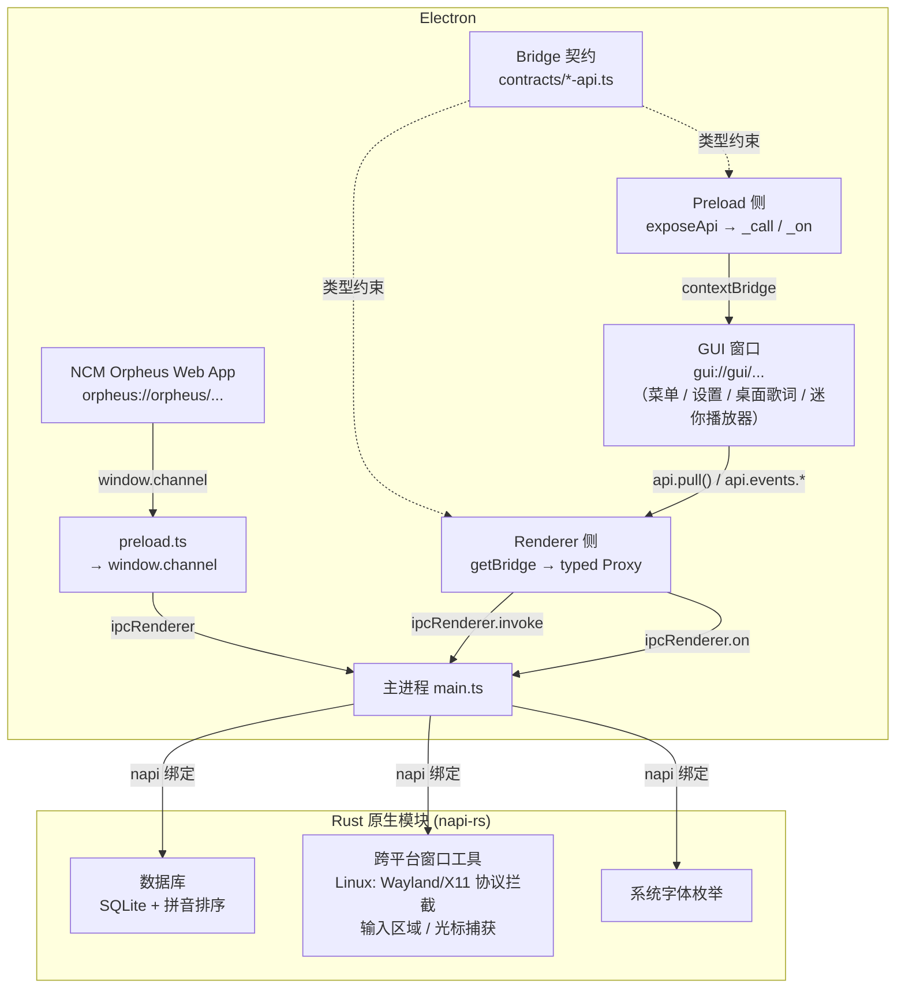

# 参与贡献 Open Orpheus

[English Version](docs/CONTRIBUTING_en.md)

首先，感谢你愿意花时间为 Open Orpheus 做贡献！不论是提交 issue、改进文档还是贡献代码，每一份帮助都十分珍贵。

## 目录

- [行为准则](#行为准则)
- [项目概览](#项目概览)
- [提交 Issue](#提交-issue)
- [提交 Pull Request](#提交-pull-request)
- [开发环境搭建](#开发环境搭建)

## 行为准则

请保持友好、包容的交流态度。我们希望 Open Orpheus 对所有人都是一个友好的开源社区。详见 [CODE_OF_CONDUCT.md](./CODE_OF_CONDUCT.md)。

## 项目概览

Open Orpheus 是一个基于 Electron 打造的网易云音乐 Orpheus 浏览器宿主。它并不篡改或重新实现客户端逻辑，而是为原版 Orpheus Web 应用提供一个跨平台的运行环境，重点关注**互操作性**。

### 技术栈

| 层级     | 技术                                                      |
| -------- | --------------------------------------------------------- |
| 应用壳   | Electron + Node                                           |
| 原生模块 | Rust（napi-rs），通过 Cargo workspace 管理                |
| 渲染界面 | Svelte 5 + Tailwind CSS（`gui/`，包括设置页、右键菜单等） |
| 构建工具 | Electron Forge + Vite                                     |
| 包管理   | pnpm workspace                                            |

### 目录结构

```
open-orpheus/
├── src/                    # Electron 主进程 & preload
│   ├── main.ts             # 应用入口，单实例锁，协议注册
│   ├── preload.ts          # 渲染进程桥接入口
│   ├── main/               # 主进程逻辑（窗口、IPC、网络、缓存……）
│   │   ├── calls/          # IPC 命令处理器（winhelper、app 等）
│   │   ├── packs/          # WebPack / SkinPack 加载器
│   │   ├── menu.ts         # 右键菜单管理（Electron BrowserWindow）
│   │   ├── orpheus.ts      # orpheus:// 自定义协议
│   │   ├── window.ts       # BrowserWindow 管理
│   │   └── ...             # 网络请求、加解密、下载、缓存、托盘等
│   ├── preload/            # preload 暴露的 API（channel 桥接）
│   │   └── ...             # 播放控制、听歌识曲、云信 IM 桥接等
│   ├── bridge/             # 类型化 RPC 框架（契约 / preload 暴露 / renderer Proxy / main 注册）
│   │   └── ...
│   └── worklets/           # AudioWorklet 处理器
├── gui/                    # Svelte 前端（设置页、桌面歌词、右键菜单等）
│   └── src/
│       ├── routes/         # 页面路由
│       │   ├── (transparent)/ # 透明窗口路由（menu, desktop-lyrics, mini-player）
│       │   └── ...         # 调试、打包管理、协议配置、桌面歌词设置等页面
│       └── lib/            # 共享组件 & 工具
│           └── ...         # Bridge Proxy、UI 组件、Svelte hooks 等
├── modules/                # Rust 原生模块（napi-rs）
│   ├── ui/                 # 系统字体枚举
│   ├── database/           # SQLite 数据库绑定（含拼音排序）
│   ├── window/             # 跨平台窗口工具（Linux 下深度集成 Wayland/X11 协议拦截、输入区域、光标捕获）
│   └── lifecycle/          # 退出回调等生命周期工具
├── scripts/                # 构建脚本（模块编译、Flatpak 等）
├── packaging/              # 各平台打包配置
├── data/                   # 开发用运行时数据（资源、缓存、日志）
└── patches/                # 依赖补丁
```

### 架构鸟瞰



- **主进程**（`src/main/`）是控制中心：管理 BrowserWindow 生命周期、注册 `orpheus://` 协议、处理网络请求、分发 IPC 调用。
- **主窗口 Preload**（`src/preload.ts`）暴露 `window.channel`，专供 NCM Orpheus Web 应用使用，基于 CallDispatcher 的命令分发模式。
- **Bridge 框架**（`src/bridge/`）是主进程与 GUI 窗口之间的类型化 RPC 层，分三层协作：
  1. **契约层**（`contracts/*-api.ts`）—— TypeScript 接口，定义每个窗口的完整 API 面（方法签名、事件签名、同步值），主进程和渲染进程共享同一份类型。
  2. **Preload 侧**（`preload.ts` → `exposeApi(prefix, syncValues)`）—— 通过 `contextBridge` 暴露原始 `_call(channel, ...args)` 和 `_on(event, callback)` 原语，各窗口 preload（`src/windows/*.ts`）按需调用。
  3. **Renderer 侧**（`gui/src/lib/bridge.ts` → `getBridge<T>(name)`）—— 用 Proxy 将属性访问自动映射为 channel 路径：`api.cache.getStats()` → `_call("cache.getStats")`，`api.events.lyricsUpdate(cb)` → `_on("lyricsUpdate", cb)`，提供完整的类型推导和 IDE 自动补全。
  4. **Main 侧**（`register.ts` → `registerIpcHandlers(wc, prefix, handlers)`）—— 遍历 handler 对象树，自动为每个叶子函数注册 `ipc.handle()`；`events` 子树被排除（纯 push-from-main）。
- **GUI 界面**（`gui/`）是一个 Svelte 单页应用，负责设置页、桌面歌词、右键菜单、迷你播放器等所有辅助界面，通过 `gui://` 协议加载。菜单以透明无边框 BrowserWindow 形式呈现（Wayland 下使用全屏覆盖层方案）。
- **原生模块**（`modules/`）通过 napi-rs 为 Electron 主进程提供底层能力：SQLite 数据库（含中文拼音排序）、跨平台窗口工具（Linux 下深度集成 Wayland/X11 协议拦截、输入区域设置、窗口拖拽、光标捕获）、系统字体枚举等。

### 关键概念

- **Pack 包**：网易的 `.ntpk` / `.pack` 资源格式，包含 HTML、JS、CSS、图片等 Orpheus 运行时资源。Open Orpheus 启动时自动从网易 CDN 下载，存放在 `{userData}/package/`。
- **自定义协议**：项目注册了三个特权 scheme —— `orpheus://`（Web 应用本体）、`gui://`（Svelte 辅助 UI）、`audio://`（音频流），均支持 Fetch API 和 CORS。
- **菜单渲染**：右键菜单使用 Electron BrowserWindow（无边框、透明、置顶）加载 `gui://frontend/menu` 路由。非 Wayland 环境使用定位弹窗；Wayland 下因协议限制，使用全屏透明覆盖层 + 光标捕获方案。

## 提交 Issue

Issue 是反馈 Bug、提出功能建议或讨论项目方向的主要渠道。提交前请先搜索现有 issue，避免重复。

### 报告 Bug

请尽量提供以下信息：

- **操作系统及版本**（如 Fedora 42、Windows 11）
- **桌面环境** （如果是 Linux 操作系统）
- **Open Orpheus 版本**
- **复现步骤**：能稳定复现的最小步骤
- **预期行为** vs **实际行为**
- **相关日志或截图**（如有）

> 请勿在 issue 中包含任何账号、密码或个人隐私信息。

### 功能建议

欢迎提出新功能的想法！请描述：

- 你希望实现什么效果
- 这个功能对哪些用户有帮助
- 你是否愿意参与实现

请注意，本项目的核心目标是**互操作性**，不会接受任何用于绕过广告、付费内容或 DRM 的功能。

## 提交 Pull Request

1. Fork 本仓库，并基于 `main` 分支创建你的分支（如 `feat/my-feature` 或 `fix/some-bug`）。
2. 完成修改后，确保代码可以正常构建和运行。
3. 提交 PR 时请简要描述改动内容及动机。
4. 如果你的 PR 关联了某个 issue，请在描述中用 `Closes #issue号` 关联。
5. 等待 review。维护者可能会提出修改建议，请保持耐心。

### 代码风格

- TypeScript / JavaScript：项目使用 ESLint，提交前请确保没有 lint 错误（`pnpm lint`），并且确保代码已格式化（`pnpm format`）。
- Rust：遵循标准 `rustfmt` 风格（`cargo fmt`）。
- 提交信息格式建议参考 [Conventional Commits](https://www.conventionalcommits.org/)。

## 开发环境搭建

如果你要参与开发，需要先准备好 Node 和 Rust（推荐 Node v24、Rust 1.96）。另外，请确保已添加 WebAssembly 编译目标并安装 `wasm-bindgen-cli`：

```sh
rustup target add wasm32-unknown-unknown
cargo install wasm-bindgen-cli
```

根项目这边的工作流和普通的 Electron Forge 项目差不多，不过 Open Orpheus 自己有一些原生模块，所以还得多做几步配置。

下面的步骤默认使用 `pnpm` 作为 Node 的包管理器，我们不建议使用其他包管理器。

### 安装依赖

在根目录执行一次即可，pnpm workspace 会自动为所有包（包括原生模块）安装依赖：

```sh
pnpm install
```

### 构建模块

`modules` 文件夹里有几个 Open Orpheus 运行所需的原生模块。

在根目录执行：

```sh
pnpm build:modules # 构建所有模块（会同时构建 Rust 和 Node 代码）
```

### 启动开发模式

```sh
pnpm start
```

这会以开发模式启动 Electron 应用，支持热重载（renderer 部分）。
