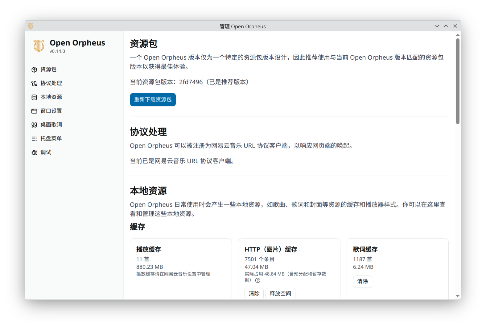

# Open Orpheus


[English Version](docs/README_en.md)

一个对网易云音乐 Orpheus 浏览器宿主的开源实现。

项目当前的开发计划请追踪：https://github.com/users/YUCLing/projects/3

## 功能

- 跨平台支持
  - 优秀的原生 Wayland 支持
  - X11
  - macOS
  - Windows
- 开源

不然你还想要啥！它本质上就是给原版客户端提供一个运行环境！

## 截图

<details>
<summary>主界面</summary>


</details>

<details>
<summary>播放界面</summary>


</details>

<details>
<summary>设置界面</summary>



</details>

<details>
<summary>迷你播放器和桌面歌词</summary>


</details>

<details>
<summary>迷你播放器列表</summary>


</details>

## 安装

### Flathub

通过 Flathub 一键安装

[](https://flathub.org/zh-Hans/apps/io.github.yucling.open-orpheus)

### Fedora Linux

[](https://copr.fedorainfracloud.org/coprs/luorain/open-orpheus/package/open-orpheus/)

可通过 Copr 仓库进行安装

```sh
dnf copr enable luorain/open-orpheus # 启用 Copr 仓库
dnf install open-orpheus # 安装
```

### Arch Linux（第三方AUR）

感谢 @zlicdt 发布

https://aur.archlinux.org/packages/open-orpheus

### Debian Linux、Flatpak、AppImage、Windows、macOS

前往 [Releases](https://github.com/YUCLing/open-orpheus/releases/latest) 下载

### 资源文件

这个项目不会打包某些必需资源，因为它们归网易所有。

Open Orpheus 在首次启动时如果检测到资源缺失，会自动从网易的 CDN **自动下载**，通常无需手动配置。

资源存放在数据目录的子文件夹 `package` 中：

- 开发模式：`data/package/`（相对于工作目录）
- 打包后：`{userData}/package/`

#### `package` 和 `resource` 文件夹

整个 `package` 和 `resource` 文件夹都是必需的。

如果自动下载失败，可以从官方网易云音乐的安装目录手动复制这两个文件夹，例如 `C:\path\to\your\installation\CloudMusic\package`，并将其放入上述数据目录中。**注意：`package` 是 `package` 文件夹的子文件夹，也就是说复制完后应该是 `package/package/`！**

## 免责声明

Open Orpheus 是一个以**互操作性**为目的的独立开源项目，与网易公司没有任何关联、授权或认可关系。

- **本项目不包含、不分发任何归网易所有的资产或代码。** 运行所需的资源文件（如 `orpheus.ntpk`）归网易公司所有，用户须自行从合法取得的官方客户端中获取，或由程序在首次启动时从网易官方 CDN 自动下载。
- **本项目不提供、不鼓励、不支持任何用于绕过广告、付费内容、会员权益或数字版权保护机制（DRM）的功能或修改。** 任何此类用途均明确超出本项目的范围，且会被主动抵制。
- 使用本项目时，您仍需遵守网易云音乐的[网易云音乐服务条款](https://st.music.163.com/official-terms/service)及相关法律法规。
- 本项目按"现状"提供，不对因使用本项目所产生的任何后果（包括但不限于账号封禁、服务中断或法律责任）承担责任。

> "网易云音乐"、"Orpheus" 等名称及相关商标归网易公司所有。
