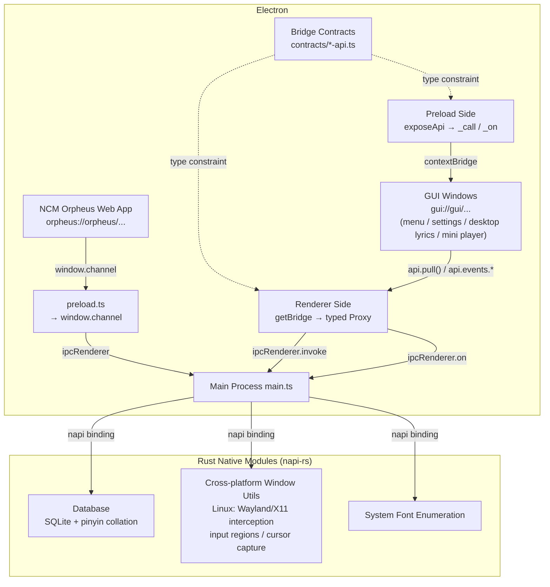

# Contributing to Open Orpheus

[中文版](./CONTRIBUTING.md)

First off, thank you for taking the time to contribute to Open Orpheus! Whether it's filing a bug report, improving documentation, or submitting code, every contribution matters.

## Table of Contents

- [Code of Conduct](#code-of-conduct)
- [Project Overview](#project-overview)
- [Submitting Issues](#submitting-issues)
- [Submitting Pull Requests](#submitting-pull-requests)
- [Development Setup](#development-setup)

## Code of Conduct

Please be kind and respectful in all interactions. We want Open Orpheus to be a welcoming community for everyone. See [CODE_OF_CONDUCT_en.md](./CODE_OF_CONDUCT_en.md) for the full text.

## Project Overview

Open Orpheus is an Electron-based host for Netease Cloud Music's Orpheus browser runtime. It does not modify or reimplement the client logic — instead it provides a cross-platform runtime environment for the original Orpheus web application, with a focus on **interoperability**.

### Tech Stack

| Layer           | Technology                                                                |
| --------------- | ------------------------------------------------------------------------- |
| App Shell       | Electron + Node                                                           |
| Native Modules  | Rust (napi-rs), managed via Cargo workspace                               |
| Renderer UI     | Svelte 5 + Tailwind CSS (`gui/`, including settings, context menus, etc.) |
| Build Tools     | Electron Forge + Vite                                                     |
| Package Manager | pnpm workspace                                                            |

### Directory Structure

```
open-orpheus/
├── src/                    # Electron main process & preload
│   ├── main.ts             # App entry point, single-instance lock, protocol registration
│   ├── preload.ts          # Renderer bridge entry
│   ├── main/               # Main process logic (window, IPC, networking, cache...)
│   │   ├── calls/          # IPC command handlers (winhelper, app, etc.)
│   │   ├── packs/          # WebPack / SkinPack loaders
│   │   ├── menu.ts         # Context menu management (Electron BrowserWindow)
│   │   ├── orpheus.ts      # orpheus:// custom protocol
│   │   ├── window.ts       # BrowserWindow management
│   │   └── ...             # Networking, crypto, download, cache, tray, etc.
│   ├── preload/            # Preload-exposed APIs (channel bridge)
│   │   └── ...             # Playback control, music recognition, IM bridge, etc.
│   ├── bridge/             # Typed RPC framework (contracts / preload exposure / renderer Proxy / main registration)
│   │   └── ...
│   └── worklets/           # AudioWorklet processors
├── gui/                    # Svelte frontend (settings, desktop lyrics, context menus, etc.)
│   └── src/
│       ├── routes/         # Page routes
│       │   ├── (transparent)/ # Transparent window routes (menu, desktop-lyrics, mini-player)
│       │   └── ...         # Debug, package management, protocol config, desktop lyrics settings, etc.
│       └── lib/            # Shared components & utilities
│           └── ...         # Bridge Proxy, UI components, Svelte hooks, etc.
├── modules/                # Rust native modules (napi-rs)
│   ├── ui/                 # System font enumeration
│   ├── database/           # SQLite database bindings (with pinyin collation)
│   ├── window/             # Cross-platform window utilities (deep Linux integration: Wayland/X11 protocol interception, input regions, cursor capture)
│   └── lifecycle/          # Exit callbacks and lifecycle utilities
├── scripts/                # Build scripts (module compilation, Flatpak, etc.)
├── packaging/              # Per-platform packaging configuration
├── data/                   # Development runtime data (resources, cache, logs)
└── patches/                # Dependency patches
```

### Architecture Overview



- **Main Process** (`src/main/`) is the control center: manages BrowserWindow lifecycle, registers the `orpheus://` protocol, handles network requests, and dispatches IPC calls.
- **Main Window Preload** (`src/preload.ts`) exposes `window.channel`, exclusively for the NCM Orpheus web app, using a CallDispatcher-based command dispatch pattern.
- **Bridge Framework** (`src/bridge/`) is the typed RPC layer between the main process and GUI windows, with four cooperating layers:
  1. **Contract Layer** (`contracts/*-api.ts`) — TypeScript interfaces defining each window's full API surface (method signatures, event signatures, sync values), shared between main and renderer for type safety.
  2. **Preload Side** (`preload.ts` → `exposeApi(prefix, syncValues)`) — exposes raw `_call(channel, ...args)` and `_on(event, callback)` primitives via `contextBridge`; each window's preload (`src/windows/*.ts`) calls it as needed.
  3. **Renderer Side** (`gui/src/lib/bridge.ts` → `getBridge<T>(name)`) — uses a Proxy to map property access to channel paths: `api.cache.getStats()` → `_call("cache.getStats")`, `api.events.lyricsUpdate(cb)` → `_on("lyricsUpdate", cb)`, providing full type inference and IDE autocompletion.
  4. **Main Side** (`register.ts` → `registerIpcHandlers(wc, prefix, handlers)`) — walks the handler object tree, automatically registering `ipc.handle()` for each leaf function; the `events` subtree is excluded (push-from-main only).
- **GUI** (`gui/`) is a Svelte SPA responsible for settings, desktop lyrics, context menus, mini player, and all auxiliary UI, loaded via the `gui://` protocol. Menus are rendered as transparent frameless BrowserWindows (using a fullscreen overlay approach on Wayland due to protocol limitations).
- **Native Modules** (`modules/`) provide low-level capabilities to the Electron main process via napi-rs: SQLite database (with Chinese pinyin collation), cross-platform window utilities (deep Linux integration for Wayland/X11 protocol interception, input region control, window dragging, cursor capture), system font enumeration, and more.

### Key Concepts

- **Pack Files**: Netease's `.ntpk` / `.pack` resource format, containing HTML, JS, CSS, images, and other Orpheus runtime assets. Open Orpheus automatically downloads them from Netease's CDN on first launch and stores them in `{userData}/package/`.
- **Custom Protocols**: The project registers three privileged schemes — `orpheus://` (the web app itself), `gui://` (Svelte auxiliary UI), and `audio://` (audio streaming) — all supporting Fetch API and CORS.
- **Menu Rendering**: Context menus use Electron BrowserWindows (frameless, transparent, always-on-top) loading the `gui://frontend/menu` route. On non-Wayland environments, a positioned popup window is used; on Wayland, a fullscreen transparent overlay with cursor capture is used due to protocol constraints.

## Submitting Issues

Issues are the main channel for reporting bugs, suggesting features, and discussing the project's direction. Before opening a new issue, please search existing ones to avoid duplicates.

### Reporting Bugs

Please include as much of the following as possible:

- **OS and version** (e.g. Fedora 42, Windows 11)
- **Desktop environment** (if on Linux)
- **Open Orpheus version**
- **Steps to reproduce** — the minimal steps that reliably trigger the issue
- **Expected behavior** vs **actual behavior**
- **Relevant logs or screenshots** (if applicable)

> Do not include account credentials or any private information in issues.

### Feature Requests

Ideas for new features are welcome! Please describe:

- What you'd like to see
- Who would benefit from it
- Whether you'd be willing to help implement it

Note that the core goal of this project is **interoperability**. Features intended to bypass ads, paid content, or DRM will not be accepted.

## Submitting Pull Requests

1. Fork the repository and create your branch from `main` (e.g. `feat/my-feature` or `fix/some-bug`).
2. Make your changes and verify the project builds and runs correctly.
3. Write a clear PR description explaining what you changed and why.
4. If your PR addresses an issue, reference it with `Closes #issue-number` in the description.
5. Submit and wait for review. Maintainers may request changes — please be patient.

### Code Style

- TypeScript / JavaScript: The project uses ESLint. Make sure there are no lint errors before submitting (`pnpm lint`).
- Rust: Follow standard `rustfmt` style (`cargo fmt`).
- Commit messages should be in English. The [Conventional Commits](https://www.conventionalcommits.org/) format is recommended.

## Development Setup

You will need Node and Rust to work with this project (Node v24 and Rust 1.96 are recommended). Also, make sure to add the WebAssembly compilation target and install `wasm-bindgen-cli`:

```sh
rustup target add wasm32-unknown-unknown
cargo install wasm-bindgen-cli
```

For the root project, everything works just like any other Electron Forge project, but Open Orpheus has some native modules of its own, which require a few extra setup steps.

In the following steps, `pnpm` will be used as Node's package manager. Other package managers are not recommended.

### Install Dependencies

Run this once at the root — pnpm workspaces will install dependencies for all packages including native modules:

```sh
pnpm install
```

### Build Modules

Inside `modules` folder, there are a few native modules that Open Orpheus requires to run.

Run from the root directory:

```sh
pnpm build:modules # Build all modules (will build both Rust and Node code)
```

### Start Development Mode

```sh
pnpm start
```

This launches the Electron app in development mode with hot reload for the renderer.
