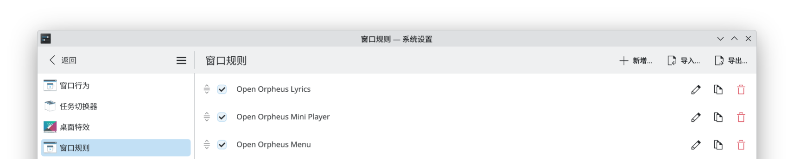
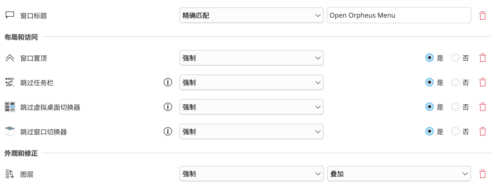
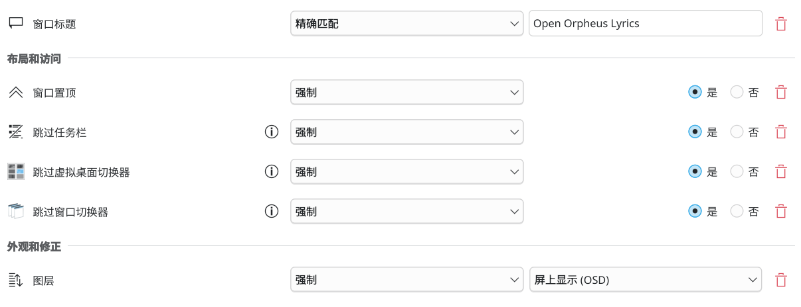

# WM 窗口规则配置

由于 Wayland 协议的限制，Open Orpheus 无法自动完成部分窗口属性的设置，可能会严重影响使用体验。该文档将帮助你通过 WM 自带的窗口规则，优化 Open Orpheus 在 Wayland 环境下的使用体验。

本文档在窗口规则的配置中，将仅通过窗口标题对 Open Orpheus 的对应窗口进行匹配。此外，本文档的窗口规则仅作为参考建议，你也可以自行调整优化，使其更符合你的使用习惯。

## KDE

KDE 的窗口规则设置可在 `系统设置 > 应用和窗口 > 窗口管理 > 窗口规则` 中找到。



以下是 KDE 环境下建议的窗口规则配置：

### 菜单



<details>
<summary>文本描述</summary>

#### 窗口匹配

- 窗口标题：`精确匹配` `Open Orpheus Menu`

#### 布局和访问

- 窗口置顶：`强制` `是`
- 跳过任务栏：`强制` `是`
- 跳过虚拟桌面切换器：`强制` `是`
- 跳过窗口切换器：`强制` `是`

#### 外观和修正

- 图层：`强制` `叠加`

</details>

### 迷你播放器


<details>
<summary>文本描述</summary>

#### 窗口匹配

- 窗口标题：`精确匹配` `Open Orpheus Mini Player`

#### 布局和访问

- 窗口置顶：`强制` `是`

</details>

### 桌面歌词



<details>
<summary>文本描述</summary>

#### 窗口匹配

- 窗口标题：`精确匹配` `Open Orpheus Lyrics`

#### 布局和访问

- 窗口置顶：`强制` `是`
- 跳过任务栏：`强制` `是`
- 跳过虚拟桌面切换器：`强制` `是`
- 跳过窗口切换器：`强制` `是`

#### 外观和修正

- 图层：`强制` `屏上显示（OSD）`

</details>

## niri

niri 下光标交互无法穿透到浮动窗口下方，关闭菜单只能通过 Esc 按键。

### 菜单

```kdl
window-rule {
  match title="^Open Orpheus Menu$"

  open-floating true

  default-floating-position x=0 y=0 relative-to="top"
  default-window-height { proportion 1.0; }
  default-column-width { proportion 1.0; }

  focus-ring {
    off
  }

  border {
    off
  }
}
```

### 迷你播放器

```kdl
window-rule {
  match title="^Open Orpheus Mini Player$"

  open-floating true

  focus-ring {
    off
  }

  border {
    off
  }
}
```

### 桌面歌词

```kdl
window-rule {
  match title="^Open Orpheus Lyrics$"

  open-floating true

  focus-ring {
    off
  }

  border {
    off
  }
}
```

## 通用信息

对于其他没有提及到的 WM，你也可以根据以下信息自行配置。

### 窗口标题

| 窗口       | 标题                     |
| ---------- | ------------------------ |
| 菜单       | Open Orpheus Menu        |
| 迷你播放器 | Open Orpheus Mini Player |
| 桌面歌词   | Open Orpheus Lyrics      |

### 环境变量

| 变量                            | 描述                                     | 备注                                              |
| ------------------------------- | ---------------------------------------- | ------------------------------------------------- |
| `MENU_OVERLAY_NO_FULLSCREEN`    | 禁用菜单全屏                             | 对全屏窗口背景不透明的 WM 默认激活，如非 KDE 桌面 |
| `MENU_OVERLAY_FORCE_FULLSCREEN` | 强制启用菜单全屏                         |                                                   |
| `MENU_OVERLAY_NO_MAXIMIZE`      | 禁用菜单自动最大化                       | 对部分 Tiling WM 默认激活，如 niri                |
| `MENU_OVERLAY_FORCE_MAXIMIZE`   | 强制启用菜单最大化（需要菜单全屏被禁用） |                                                   |
